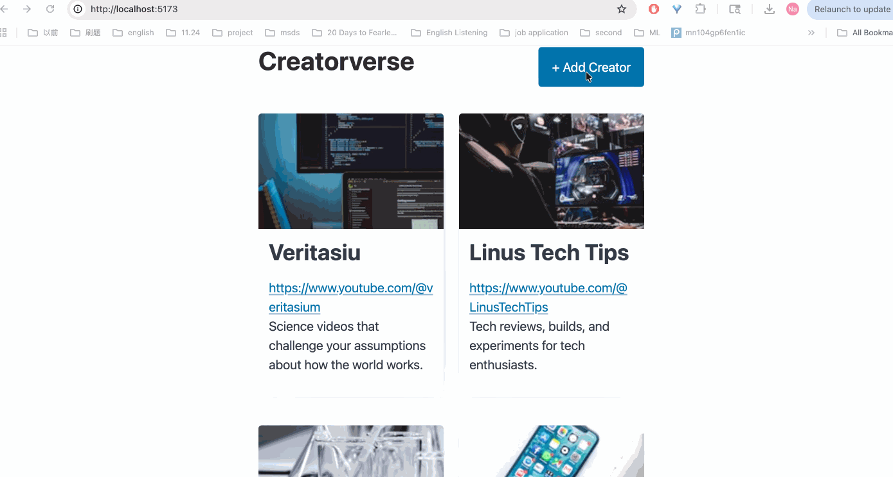

# Creatorverse

A full-stack web app to manage your favorite content creators. Built with React, Vite, and Supabase.

## Video Walkthrough



## Features

### Required Features
- [x] Use a logical component structure in React to create the frontend of the app
- [x] Display at least five content creators on the homepage of the app
- [x] Each content creator item includes their name, a link to their channel or page, and a short description
- [x] API calls use the async/await design pattern via Supabase
- [x] Clicking on a content creator item takes the user to their details page
- [x] Each content creator has their own unique URL
- [x] The user can edit a content creator to change their name, url, or description
- [x] The user can delete a content creator
- [x] The user can add a new content creator
- [x] The new content creator then appears in the displayed list

### Stretch Features
- [x] Use PicoCSS to style HTML elements
- [x] Display content creator items in a creative format, like cards instead of a list
- [x] Show an image of each content creator on their content creator card

## Tech Stack

- React
- Vite
- Supabase
- PicoCSS
- React Router

## Getting Started

```bash
npm install
npm run dev
```